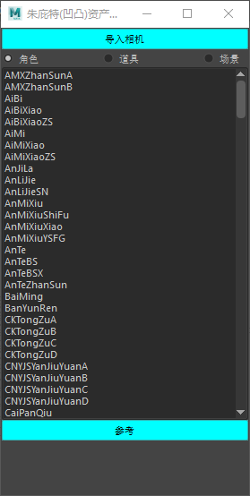

# 动画工具

## 安装
首先确保前期准备工作已经完成

查看 `T:/projects/aotutv/scripts`

## 使用
`我的文档/2015` 即为maya的预设存放的目录,请检查自己的预设

执行 `t:/projects/aotutv/scripts/maya环境搭建.bat`,检查 `我的文档/maya/2015`中是否覆盖了Maya.env

如果没有覆盖，请直接拷贝 `T:/projects/aotutv/scripts/Maya.env` 到 `我的文档/maya/2015`

打开maya 2015 确保能够看到

## 工具
- 资产工具
- 动画工具

### 资产工具
可以导入 角色|道具|场景

### 动画工具
- 输入
    - 集数
    - 镜头号
    - 类型
- 自动获取 文件名,相机名
- 选中相机,执行 <b>命名选中相机</b>
    - 可以手动命名
- 保存文件
    - 可以在本地盘的任意地方
- 拍屏
    - 需要先保存文件
- 上传到同步盘
    - 必须存在拍屏

